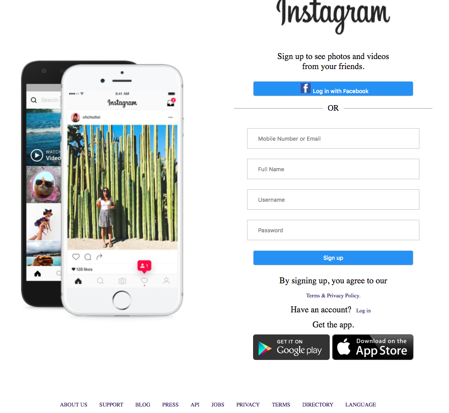
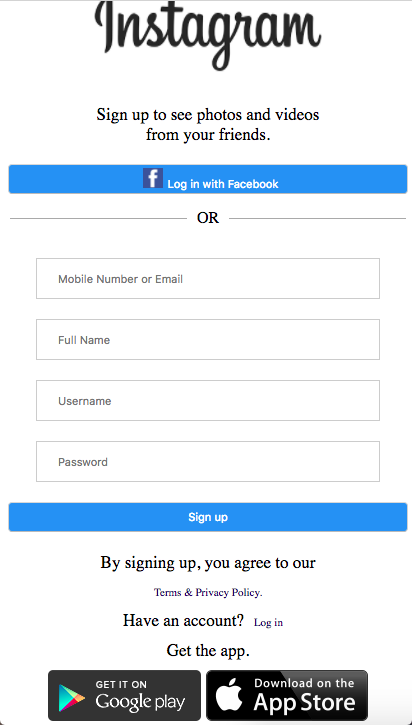

# Instagram Homework

## Objective

For this homework I had to recreate the layout of the Instagram homepage using HTML and CSS.

### Screenshots of the outcome

*Screenshot of the Desktop version of the site.*

*Screenshot of the Mobile version of the site.*

## Methods Used

While doing this homework I first used the box-model to create the layout of the page in HTML. I then used CSS to add some styling to the page and make it look good. Media queries were used in order to change the layout of the page depending on the screen size, in this case desktop vs mobile screen sizes.

